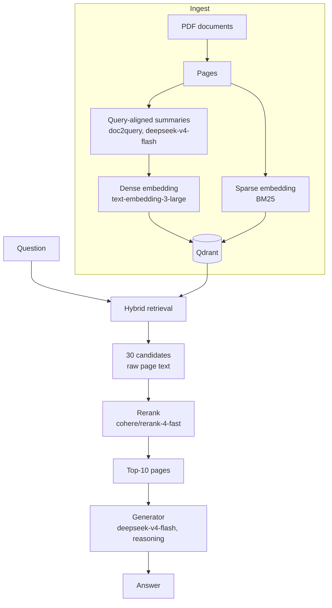
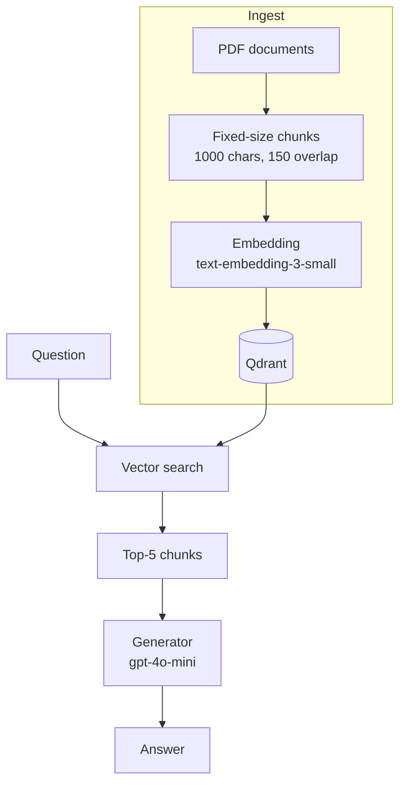

# FinanceRAG

A retrieval-augmented generation (RAG) system for querying corporate financial filings (10-K, 10-Q, earnings releases). Reaches **82.7% answer correctness** on the [FinanceBench](https://github.com/patronus-ai/financebench) benchmark.

## Getting Started

### Prerequisites

- An [OpenRouter](https://openrouter.ai) API key (serves every model in the pipeline)
- Qdrant running locally (`docker run -p 6333:6333 qdrant/qdrant`)
- [FinanceBench](https://github.com/patronus-ai/financebench) dataset (clone its repository next to this one)

### Installation

```powershell
# 1. Clone the repository and enter it
git clone https://github.com/vshereperov/financerag.git
cd financerag

# 2. Create and activate a virtual environment
python -m venv .venv
.venv\Scripts\activate

# 3. Install dependencies
pip install -r requirements.txt

# 4. Create the config file, then fill in your values
copy .env.example .env
```

On macOS/Linux, use these instead for steps 2 and 4:

```bash
# 2. Create and activate a virtual environment
python -m venv .venv
source .venv/bin/activate

# 4. Create the config file, then fill in your values
cp .env.example .env
```

## Usage

**1. Ingest documents into the vector store (run once first):**
```bash
python -m src.ingest
```

**2. Ask a question:**
```console
$ python -m src.cli "What are the geographies that American Express primarily operates in as of 2022?"
Answer:
Based on the geographic operations table in the 10-K, American Express primarily
operates in the following geographic regions as of 2022: United States, EMEA (Europe,
the Middle East and Africa), APAC (Asia Pacific, Australia and New Zealand), and LACC
(Latin America, Canada and the Caribbean) (American Express, 2022 10-K, page 155).
```

**3. Run evaluation:**
```bash
python -m src.eval
python -m src.eval --debug  # show per-question verdicts
```

## Pipeline



## Evaluation

Metrics:

- **Retrieval hit-rate** — did the gold page land in top-k
- **Answer correctness** — does the generated answer match the gold answer
- **Faithfulness** — is the answer grounded in retrieved context, not hallucinated

Correctness and faithfulness are scored by an LLM judge (`gpt-5.1`).

## Results

Evaluated on the 150-question FinanceBench benchmark.

| Metric            | Value   |
|-------------------|--------:|
| Hit-rate@10       | 86.7%   |
| Correctness       | 82.7%   |
| Faithfulness      | 92.0%   |
| Cost per question | ~$0.003 |

## Error Analysis

A question can fail in two independent places: **retrieval** (did we fetch the page
that holds the answer?) and **correctness** (did the final answer match the gold
answer?). Across the 150 questions, retrieval missed the gold page **20 times**
(hit-rate@10 = 86.7%) and correctness was off on **27 answers** (25 incorrect and
2 partial, so 82.7%).

The interesting part is that these two barely overlap. A retrieval miss usually does
not produce a wrong answer: of the 20 misses, **13 were still answered correctly**
and only 7 became actual errors. The same fact often appears on several pages, so
another retrieved page can carry it: 6 of the 13 are fully grounded in the retrieved
context and 5 partly. The remaining 2 the model got right from its own knowledge,
without support in the context. The hit-rate metric understates how often the system
can still answer.

### Where correctness goes wrong

Since retrieval rarely blocks a correct answer, the metric worth optimising is
**correctness**, which is what the user actually experiences. Of the 27 incorrect
answers, **20 happened even though the gold page had been retrieved**: the model had
the right context and still produced the wrong answer. And 17 of those 20 are still
judged faithful, meaning these are failures of reasoning rather than made-up facts.
So the next improvements should be looked for in generation first.

## Development

### Baseline pipeline

The system's first-version pipeline, kept as a reference point for comparing the
improvements that follow.



### Development steps

| #  | Step                                                       | Hit-rate@k | Correctness | Faithfulness |
|----|------------------------------------------------------------|-----------:|------------:|-------------:|
|    | **Phase 1 — evaluated on 34 questions**                    |            |             |              |
| 1  | Baseline                                                   |      29.4% |       39.7% |        88.2% |
| 2  | Add reranker (`jinaai/jina-reranker-v2-base-multilingual`) |      50.0% |       44.1% |        92.6% |
| 3  | Add hybrid retrieval                                       |      52.9% |       48.5% |        95.6% |
| 4  | Increase k to 10                                           |      55.9% |       50.0% |        85.3% |
| 5  | Switch embedder to `openai/text-embedding-3-large`         |      61.8% |       58.8% |        79.4% |
| 6  | Switch retrieval to page-level summary embeddings          |      64.7% |       57.4% |        80.9% |
| 7  | Switch reranker to `cohere/rerank-4-fast`                  |      79.4% |       72.1% |        94.1% |
| 8  | Switch to doc2query summaries                              |      91.2% |       70.6% |        91.2% |
|    | **Phase 2 — evaluated on 150 questions**                   |            |             |              |
| 8′ | Switch to doc2query summaries (re-evaluated on 150 questions) | 84.7% |    63.0% |        88.0% |
| 9  | Rewrite generation prompt                                  |      84.7% |       69.0% |        84.0% |
| 10 | Switch summary model to `deepseek/deepseek-v4-flash`       |      86.7% |       69.3% |        84.0% |
| 11 | Switch generator to `deepseek/deepseek-v4-flash`           |      86.7% |       82.7% |        92.0% |

These steps land on the final pipeline shown in the [Pipeline](#pipeline) diagram near the top of this README.
